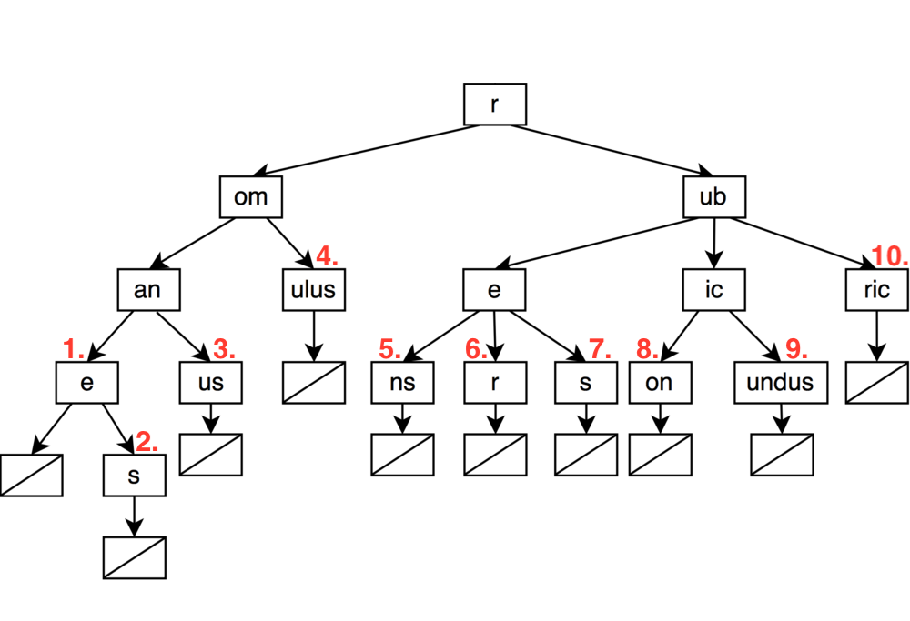

# RadixTrie
## Table of Contents

1. [Objective](#objective)
2. [Outline](#outline)
    1. [General](#general)
    2. [Object Details](#object-details)
        1. [RadixIterator Class Template](#radixiterator-class-template)
        2. [RadixTrie Class Template](#radixtrie-class-template)
    
## Objective
To create a radix trie template that's parameters allow for any value type at the end of a word.

## Outline
### General
A radix trie, more adequately described on this [wikipedia article](#https://en.wikipedia.org/wiki/Radix_tree), is a
style of a trie where nodes get compressed together if a string of branches more closely resembles a linked list.  In
this case, the compression of nodes depends not only on the number of branches, but also if the node contains a value.

### Object Details
#### RadixIterator Class Template
This class iterates through the words in the trie via a specific manner, the easiest way to describe it is graphically.
For example, assume we have a trie that includes the words (in no specific manner for now):
* rubicundus
* rubric
* romanes
* romane
* romanus
* romulus
* rubes
* rubicon
* rubens
* ruber

Then the trie would iterate through the words in the order of the red numbers as shown below:

##### Member Functions:
signature | description
----------|-----------
RadixIterator(SimpleTrieTemplate::Iterator wrapped); parameters include & and && instants of Iterator | alternative constructor taking SimpleTrieTemplate::Iterator as a parameter
RadixIterator(const RadixIterator rhs); parameters include & and && instants of RadixIterator | copy constructor
std::pair<const K, T&> operator*(); | dereference operator, returns the pair being pointed to by *this
std::pair<const K, T&> operator->(); | access operator, returns the pair being pointed to by *this
Node<K,T,S>* &get(); | returns the pointer to the node wrapped by *this
void swap(RadixIterator& rhs); | swaps all values between *this and rhs
RadixIterator &operator=(const RadixIterator rhs); parameters include & and && instants of RadixIterator | assignment operator
RadixIterator &operator++(); | prefix increments Iterator to next word
RadixIterator operator++(int); | postfix increments Iterator to next word
bool operator==(const RadixIterator &rhs) const; | compares equivalence
bool operator!=(const RadixIterator &rhs) const; | returns the opposite of operator==

#### RadixTrie Class Template
RadixTrie is basically a wrapper over SimpleTrieTemplate to specialize its use specifically for radix trie interaction.
It stores a type T at the end of every word, else the word isn't stored in the trie.

##### Member Functions:
signature | description
----------|-----------
explicit RadixTrie(); | default constructor, maintains an empty trie
explicit RadixTrie(const RadixTrie<T> rhs); parameters include & and && instants of RadixTrie | copy constructor
RadixTrie<T> &operator=(const RadixTrie<T> rhs); parameters include & and && instants of RadixTrie | assignment operator
bool empty() const noexcept; | checks whether the container is empty
uint32_t size() const noexcept; | returns the number of words in trie
void clear() noexcept; | empties the contents
RadixIterator insertOrAssign(std::pair\<std::string,T> p, Node* ancestor = nullptr); p parameters include & and && | inserts the p.second at p.first starting at the ancestor
RadixIterator insertOrAssign(std::string article, T value, Node* ancestor = nullptr); value parameters include & and && | inserts the value at the article starting at the ancestor 
void erase(std::string article,Node* ancestor = nullptr); | erases word and its value within trie
void swap(RadixTrie& rhs) noexcept; | swaps contents of *this with rhs
RadixIterator find(key_type article); | finds the node that holds the values for the article, else returns end()
std::pair<bool,iterator> scout(key_type article,Node* ancestor = nullptr); | finds the last viable node in sequence for the article. The returned pair contains, first, a boolean which holds the same value as the contains() function returns, and second, an iterator at the last viable node in sequence for the target word.  Example: given 'LOOKUP' was inserted in a BTrie, scout('LOOK') will return pair<false,iterator(node('K'))>, and scout('LOOKUP') will return pair<true,iterator(node('P'))> (where node(N) represents the node at N letter in the node sequence)
bool contains(std::string article,Node* ancestor = nullptr); | checks if the container holds a word starting at ancestor
bool operator==(const RadixTrie& rhs) const; | compares equivalence
bool operator!=(const RadixTrie& rhs) const; | returns opposite of operator==
RadixIterator begin(); | returns an iterator at the beginning of the container
RadixIterator end(); | returns an iterator one after the end of the container
